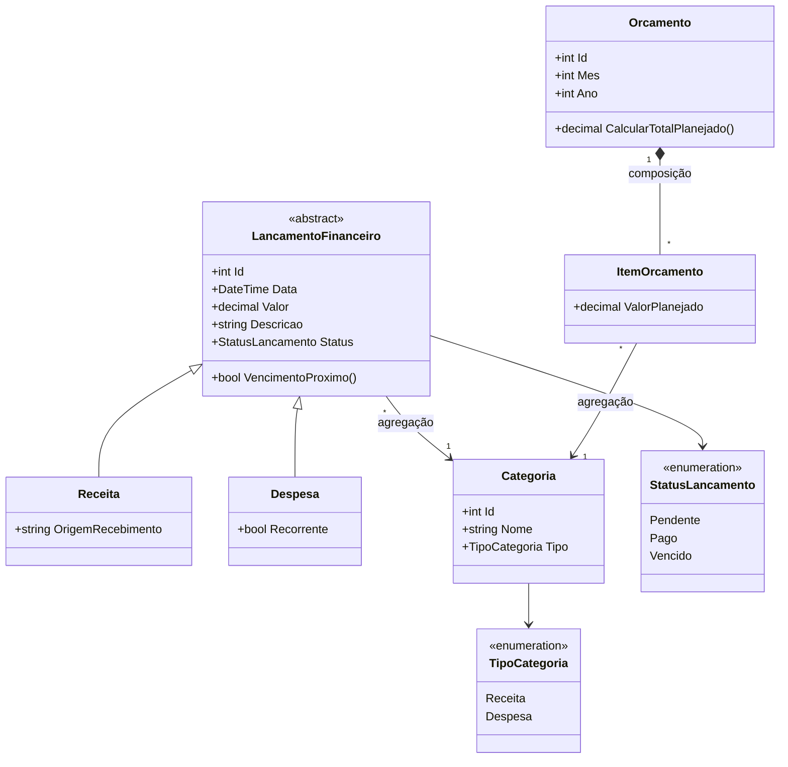

# Diagrama de Classes (Esboço) — Controle Financeiro

Esboço inicial do domínio, a ser refinado nos próximos sprints (Sprint 1 implementa composição, agregação e gestão de identidade; sprints seguintes adicionam herança/polimorfismo, coleções/LINQ e persistência).

## Notas de modelagem

- **Agregação** (`LancamentoFinanceiro` → `Categoria`, `ItemOrcamento` → `Categoria`): a categoria existe de forma independente e pode ser reutilizada por vários lançamentos/itens de orçamento.
- **Composição** (`Orcamento` *-- `ItemOrcamento`): um item de orçamento não faz sentido sem o orçamento ao qual pertence; se o orçamento for excluído, seus itens são excluídos junto.
- **Herança**: `Receita` e `Despesa` especializam `LancamentoFinanceiro`, permitindo polimorfismo nas regras de negócio (ex.: cálculo de saldo).
- Este é um esboço da Sprint 0 — atributos/métodos e relações podem mudar conforme o domínio for implementado e validado na Sprint 1.
